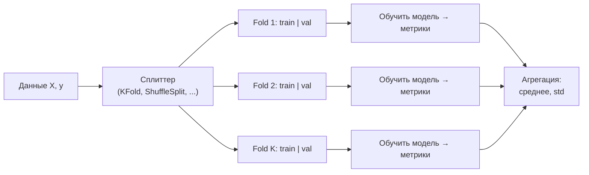

# Лабораторная работа №2 — Техники кросс-валидации

## 📌 Общая суть задания

**Цель ЛР2** — взять датасет из ЛР1, обучить на нём **линейную регрессию**, применить **не менее 5 различных техник кросс-валидации** и **сравнить** их результаты


---

## 🔍 Что уже есть в текущем ноутбуке

### 1. Датасет
- Файл `dataset.csv` — данные об **AMD процессорах** (582 строки, 30 столбцов).
- **Целевая переменная (target)**: `defaultTDP` (тепловыделение процессора в ваттах).
- **Числовые признаки**: `numCores`, `baseClock`, `L2Cache`, `sysMemSpecs`.
- **Категориальные признаки**: `platform` (Desktop, Laptop, Server и т.д.).

### 2. Предобработка и pipeline
Уже построен sklearn `Pipeline`, состоящий из:
1. **`ColumnTransformer`** — параллельно обрабатывает числовые и категориальные признаки:
   - *числовые*: `SimpleImputer(strategy='median')` — заполняет пропуски медианой.
   - *категориальные*: sub-pipeline из `SimpleImputer(strategy='most_frequent')` + `OneHotEncoder(drop='first', handle_unknown='ignore')`.
2. **`LinearRegression()`** — линейная регрессия (уже заменена с случайного леса!).

### 3. Метрики
Определена функция `calc_metrics(y_true, y_pred)`, возвращающая кортеж `(RMSE, MAE, R²)`.

### 4. Универсальная функция кросс-валидации
```python
def cross_validation(cv, cv_name, X, y, cv_results_dict, groups=None, strat=None):
```
Она:
- Получает объект-сплиттер `cv` (например, `KFold`, `ShuffleSplit` и т.д.).
- Для каждого fold-а **клонирует** модель, обучает на train-части, предсказывает на val-части.
- Считает метрики *на val-фолде* и *на тестовом наборе* (`TEST_RMSE`).
- Выводит таблицу с результатами + среднее и стандартное отклонение.

### 5. Функция визуализации
```python
def plot_cv(splits, y, cv_name):
```
Рисует 2 графика:
- **Слева**: схема разбиения (train — золотые метки, val — чёрные).
- **Справа**: гистограммы распределения целевой переменной в каждом val-фолде + на тесте.

### 6. Первая техника уже реализована
- **K-Fold без перемешивания** (`KFold(n_splits=5, shuffle=False)`).

---

## 📋 Что происходит в референсном ноутбуке (Deffro)

Оригинальный ноутбук демонстрирует **10+1 техник** кросс-валидации:

| №  | Техника                        | `sklearn` класс                 | Краткое описание |
|----|-------------------------------|---------------------------------|------------------|
| 1  | **K-Fold (no shuffle)**       | `KFold(shuffle=False)`          | Данные делятся на K частей последовательно, без перемешивания. |
| 2  | **K-Fold (shuffle)**          | `KFold(shuffle=True)`           | То же, но данные сначала перемешиваются. |
| 3  | **Stratified K-Fold**         | `StratifiedKFold`               | K-Fold, но каждый фолд сохраняет распределение целевой переменной (обычно для классификации, но можно дискретизировать target). |
| 4  | **Repeated K-Fold**           | `RepeatedKFold`                 | K-Fold повторяется несколько раз с разными разбиениями — даёт больше оценок. |
| 5  | **Leave-One-Out (LOO)**       | `LeaveOneOut`                   | Каждый объект по очереди становится валидационным. Очень дорого вычислительно. |
| 6  | **Leave-P-Out**               | `LeavePOut`                     | Как LOO, но из выборки убирается P объектов. |
| 7  | **Shuffle Split**             | `ShuffleSplit`                  | Случайное разбиение на train/val заданной пропорции, повторяется N раз. |
| 8  | **Stratified Shuffle Split**  | `StratifiedShuffleSplit`        | Shuffle Split с сохранением распределения. |
| 9  | **Group K-Fold**              | `GroupKFold`                    | K-Fold, но объекты из одной группы всегда в одном фолде (например, все записи одного пользователя). |
| 10 | **Leave-One-Group-Out**       | `LeaveOneGroupOut`              | Каждый раз из обучения исключается одна группа целиком. |
| 11 | **Time Series Split**         | `TimeSeriesSplit`               | Для временных рядов: train растёт, val всегда идёт после train. |

---

## 🎯 План работы для выполнения ЛР2

### Этап 0. Подготовка (уже сделано)

- [x] Загрузить данные из `dataset.csv`.
- [x] Определить target (`defaultTDP`), числовые и категориальные признаки.
- [x] Разбить на train/test с `train_test_split(test_size=0.2)`.
- [x] Построить pipeline с `LinearRegression` (не `RandomForest`!).
- [x] Обучить базовую модель и вывести метрики.
- [x] Написать универсальные функции `cross_validation()` и `plot_cv()`.

### Этап 1. Реализовать ≥ 5 техник кросс-валидации

> [!TIP]
> По заданию нужно **не менее 5** техник. Рекомендую выбрать 5–7, чтобы показать разнообразие.

Для каждой техники нужно:

1. Создать объект-сплиттер (например, `KFold(n_splits=5, shuffle=True, random_state=SEED)`).
2. Вызвать `cross_validation(cv, cv_name, X_train, y_train, cv_results)`.
3. Вызвать `plot_cv(splits, y_train, cv_name)` для визуализации разбиения.
4. Сохранить результаты в словарь `cv_results`.

**Рекомендуемый набор техник:**

#### 1. K-Fold без перемешивания (уже реализовано)
```python
cv = KFold(n_splits=5, shuffle=False)
res, splits = cross_validation(cv, 'KFold - no shuffle', X_train, y_train, cv_results)
plot_cv(splits, y_train, 'KFold - no shuffle')
```

#### 2. K-Fold с перемешиванием
```python
cv = KFold(n_splits=5, shuffle=True, random_state=SEED)
res, splits = cross_validation(cv, 'KFold - shuffle', X_train, y_train, cv_results)
plot_cv(splits, y_train, 'KFold - shuffle')
```

#### 3. Stratified K-Fold
Для регрессии `StratifiedKFold` требует дискретных меток. Можно бинаризовать target:
```python
from sklearn.model_selection import StratifiedKFold
import numpy as np

bins = np.quantile(y_train, [0, 0.25, 0.5, 0.75, 1.0])
y_binned = np.digitize(y_train, bins)

cv = StratifiedKFold(n_splits=5, shuffle=True, random_state=SEED)
res, splits = cross_validation(cv, 'Stratified KFold', X_train, y_train, cv_results, strat=y_binned)
plot_cv(splits, y_train, 'Stratified KFold')
```

#### 4. Shuffle Split
```python
from sklearn.model_selection import ShuffleSplit

cv = ShuffleSplit(n_splits=5, test_size=0.2, random_state=SEED)
res, splits = cross_validation(cv, 'ShuffleSplit', X_train, y_train, cv_results)
plot_cv(splits, y_train, 'ShuffleSplit')
```

#### 5. Repeated K-Fold
```python
from sklearn.model_selection import RepeatedKFold

cv = RepeatedKFold(n_splits=5, n_repeats=3, random_state=SEED)
res, splits = cross_validation(cv, 'RepeatedKFold', X_train, y_train, cv_results)
plot_cv(splits, y_train, 'RepeatedKFold')
```

#### 6. Group K-Fold (опционально)
Требуется колонка-группа (например, `platform` или `family`):
```python
from sklearn.model_selection import GroupKFold

groups = X_train['platform']
cv = GroupKFold(n_splits=3)
res, splits = cross_validation(cv, 'GroupKFold', X_train, y_train, cv_results, groups=groups)
plot_cv(splits, y_train, 'GroupKFold')
```

#### 7. Leave-One-Group-Out (опционально)
```python
from sklearn.model_selection import LeaveOneGroupOut

cv = LeaveOneGroupOut()
groups = X_train['platform']
res, splits = cross_validation(cv, 'LeaveOneGroupOut', X_train, y_train, cv_results, groups=groups)
plot_cv(splits, y_train, 'LeaveOneGroupOut')
```

> [!WARNING]
> **Leave-One-Out** (LOO) на большом датасете может быть очень медленным — для 500+ объектов с линейной регрессией это терпимо, но для отчёта может быть избыточно.

### Этап 2. Сравнение результатов

После выполнения всех техник — построить **итоговую сводную таблицу** и **графики сравнения**:

```python
import pandas as pd

summary = pd.DataFrame({
    name: {'mean_RMSE': res['RMSE'].mean(),
           'std_RMSE': res['RMSE'].std(ddof=0),
           'mean_R2': res['R2'].mean(),
           'std_R2': res['R2'].std(ddof=0),
           'mean_TEST_RMSE': res['TEST_RMSE'].mean()}
    for name, res in cv_results.items()
}).T.round(2)

summary
```

Далее — **столбчатая диаграмма** (`barplot`) для сравнения средних RMSE и R² по техникам.

### Этап 3. Выводы

В финальной ячейке написать текстовые выводы:

1. **Какая техника дала лучший/худший результат?**
2. **Почему KFold без shuffle дал плохой R² (иногда отрицательный)?**  
   — Потому что данные упорядочены (например, по семейству процессоров), и фолды получают непредставительные подвыборки.
3. **Shuffle и Stratified обычно стабильнее** — меньше разброс (std), лучше среднее R².
4. **GroupKFold / LeaveOneGroupOut** показывают, как модель обобщается на **новые группы** (платформы), что ближе к реальной задаче.
5. **Линейная регрессия vs Random Forest**: линейная модель обычно даёт худшие метрики, но лучше интерпретируема и быстрее обучается.

---

## 📖 Теоретический минимум (для понимания)

### Зачем нужна кросс-валидация?

Простое разбиение train/test **одноразовое** — результат зависит от конкретного разбиения. Кросс-валидация позволяет:
- Использовать **все данные** и для обучения, и для проверки.
- Получить **несколько оценок** качества → можно считать среднее и разброс.
- Понять, **насколько стабильна** модель при разных разбиениях.

### Как это работает?



### Ключевые метрики регрессии
- **RMSE** (Root Mean Squared Error) — среднеквадратичная ошибка. Чем меньше, тем лучше.
- **MAE** (Mean Absolute Error) — средняя абсолютная ошибка. Устойчивее к выбросам.
- **R²** (коэффициент детерминации) — доля дисперсии, объяснённая моделью. 1.0 = идеал, 0 = модель не лучше константы, <0 = хуже константы.


---

## 📂 Структура итогового ноутбука

1. **Заголовок** — «Лабораторная работа №2: Техники кросс-валидации»
2. **Загрузка и описание датасета**
3. **Предобработка** — train/test split, pipeline
4. **Базовая модель** — обучение, метрики на train/test
5. **Техника 1**: KFold (no shuffle) — код, вывод, график
6. **Техника 2**: KFold (shuffle) — код, вывод, график
7. **Техника 3**: Stratified KFold — код, вывод, график
8. **Техника 4**: ShuffleSplit — код, вывод, график
9. **Техника 5**: RepeatedKFold — код, вывод, график
10. *(Опционально)* **Техника 6**: GroupKFold — код, вывод, график
11. *(Опционально)* **Техника 7**: LeaveOneGroupOut — код, вывод, график
12. **Итоговое сравнение** — сводная таблица + bar chart
13. **Выводы** — текстовый анализ результатов
